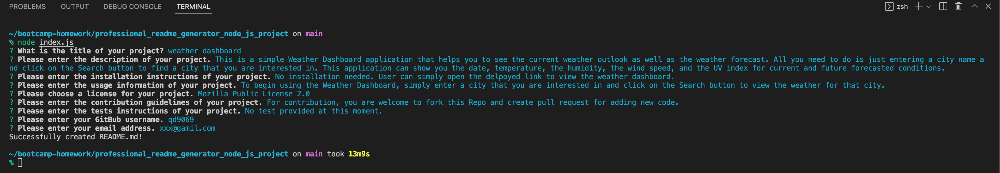
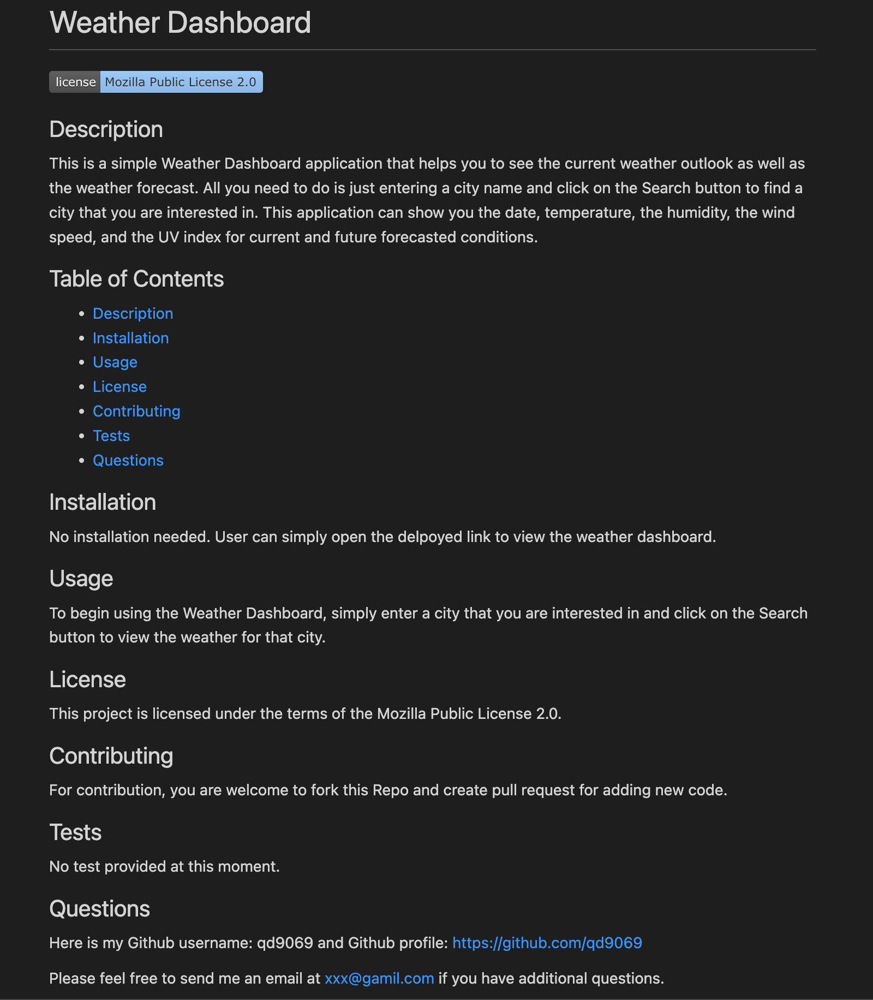

# Professional README Generator - Node.js Project


## Description

A high-quality README file is very important to an open source project/application. This Professional README Generator is a command-line application that helps developers to quickly generate a README.md file with their inputs. The generated README file will contain the title of your project and a table of contents with the following sections: Description, Installation, Usage, License, Contributing, Tests, and Questions.


## Table of Contents 

- [Description](#description)
- [Installation](#installation)
- [Usage](#usage)
- [Technology](#technology)
- [Credits](#credits)
- [Assets](#assets)
- [Link](#link)
- [License](#license)

## Installation

The README generator is functioning with the npm Inquirer.js.

Here is a simple installation instruction: After cloning the Repo to your computer
- Open the terminal and enter the following commands:
    - `npm init -y`
    - `nmp i inquirer`
- The `npm init -y` will download the package.json and package-lock.json
- The `nmp i inquirer` will install the inquirer dependency
    - If you open the package.json, make sure that you see the inquirer dependency is there
- Make sure your Repo has the .gitignore file which includes `node_modules` and `.DS_Store` (for macOS) before installing any npm dependencies

## Usage

Please follow the simple instruction here:
- Clone this Repo to your computer
- Follow the installation instruction above to install npm Inquirer
- Open the terminal and go to the directory that this Repo has been cloned to
- Type the following command in terminal: 
    - node index.js
- Answer the prompts/questions that displayed in your terminal
    - For license - select the license that you want from the option list and a badge for that license will be added near the top of the README file
- After completing all of the prompts/questions, a message "Successfully created README.md!" with be displayed in the terminal.
    - You will see the new README file is generated in your current directory

## Technology
```md
JavaScript
```

## Credits

- The README generator is functioning with [npm Inquirer.js](https://www.npmjs.com/package/inquirer)

- The starter code is from The Coding Boot Camp | UC San Diego Extension

    Trilogy Education Services, LLC


## Assets

The following images demonstrate the README generator's functionality:

In terminal:



Sample README file that generated by this app:




**Please find this sample README.md file in the `assets/sample-readme` folder in this Repo**

## Link

Please click [here](https://qd9069.github.io/) to find the walkthrough video that demonstrates the functionality of the README generator.

## License

Copyright (c) 2022 Elaine D. This project is licensed under the terms of the MIT license.
